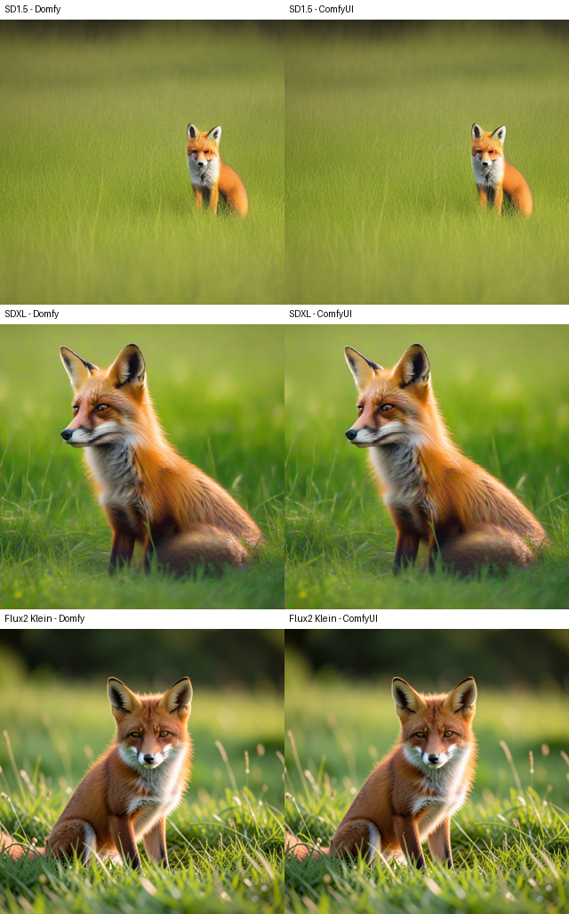

# CPU and Apple Silicon execution

`dinkster-serve` supports GPU-less CPU workers and Apple Silicon MPS workers.
Device selection belongs to each worker, not the engine host. Use
`DINKSTER_ACCELERATOR=cpu` to force CPU, `mps` to require MPS, or leave it unset
for automatic selection. See [worker setup](serve-cli.md#cpu-and-apple-silicon-workers).

## Verified environment

Apple M4, 32 GiB unified memory, macOS 15.7.4 (24G517), arm64 CPython
3.12.11, PyTorch 2.13.0, torchvision 0.28.0, NumPy 2.5.1, Pillow 12.0.0,
comfy-kitchen 0.2.32, and comfy-aimdo 0.5.2. Environments and downloads are
clone-local; neither a system Python install nor a CUDA runtime is required.
The engine environment is torch-free. The comparison uses a separate,
unmodified [ComfyUI master checkout](https://github.com/Comfy-Org/ComfyUI/commit/15eb748b3ec5f8a0a2d470b7fb280e2d7579f916)
with matching PyTorch and image-library versions on the same Mac.

## Pack matrix

| Pack | CPU/macOS result | Executed coverage |
| --- | --- | --- |
| `dinkster-nodes-foundation` | Announced; workflow passed | Integer value feeding image width |
| `dinkster-nodes-image` | Announced; workflow passed | Empty image and invert |
| `dinkster-nodes-media-io` | Announced; workflow passed | Save PNG through a writable library mount |
| `dinkster-nodes-generation` | Announced; workflow passed | SD1.5, SDXL, and Klein native generation |
| `dinkster-compat-comfy` | Announced; workflow passed | Translated image and model workflows |
| `dinkster-nodes-remote` | Announced | No external provider request in this matrix |
| `dinkster-nodes-training`, `dinkster-training-worker` | Announced | No training run in this matrix |
| Standard vision packs | All announced | Model inference not covered by this matrix |

The nine standard vision packs are BiRefNet, Depth Anything V2/V3, DETR,
EfficientSAM, HED, RT-DETR, SAM 3.1, and upscale. Announcement validates
composition and dependency availability, not every node's execution support.
The server composed 17 packs and advertised 864 node types. Existing
capability-gated CUDA tests are not evidence for MPS, and this matrix does not
claim CUDA-only kernels, every model family, or arbitrary third-party packs.

## Workflow matrix

All workflows enter through `POST /api/compat/comfy/prompt`, finish with a
completed job, and produce a decoded RGB PNG. The reference receives the same
ComfyUI API graph through `/prompt`. Generation uses seed 7, Euler, batch 1,
the positive prompt `a photograph of a red fox sitting in a green meadow,
soft morning light`, and an empty negative prompt where CFG is used.

| Workflow | Device | Dimensions / steps | Precision: diffusion / text / VAE | Result |
| --- | --- | --- | --- | --- |
| PrimitiveInt -> EmptyImage -> ImageInvert -> SaveImage | CPU | 64x48 | No model | Pass; pixel-exact reference image |
| SD1.5 KSampler | CPU | 256x256 / 4 | FP16 / BF16 / FP32 | Pass |
| SD1.5 KSampler | MPS | 512x512 / 8 | FP16 / BF16 or FP32 / FP32 | Pass |
| SDXL base KSampler | MPS | 1024x1024 / 8 | FP16 / BF16 or FP32 / FP32 | Pass |
| Flux2 Klein 4B SamplerCustomAdvanced | MPS | 512x512 / 4 | BF16 / BF16 or FP32 / FP32 | Pass |

For a precision-matched comparison, select FP32 text computation in Dinkster.
ComfyUI's BF16 text flag controls stored weights; its CLIP and Qwen text
forward paths compute in FP32. Dinkster's text setting controls computation.
Klein with FP32 text on MPS produced a pixel-identical PNG to the reference
with MPS text execution (`--gpu-only`). BF16 text remains an explicitly
lower-precision option, not a pixel-parity promise.

SD1.5 and SDXL use CheckpointLoaderSimple, CLIPTextEncode, EmptyLatentImage,
KSampler (CFG 7, normal scheduler, denoise 1), VAEDecode, and SaveImage.
Klein uses separate UNETLoader/CLIPLoader/VAELoader, CLIPTextEncode,
EmptyFlux2LatentImage, RandomNoise, BasicGuider, KSamplerSelect,
Flux2Scheduler, SamplerCustomAdvanced, VAEDecode, and SaveImage. The Klein
graph exercises sampling settings crossing from the default worker to the
model-owning native worker; it is not an in-process-only test.



With FP32 text on both sides, mean absolute RGB errors on the 0-255 scale
were 0.2004 (SD1.5), 0.4812 (SDXL), and 0 (Klein). SD model inputs and
conditioning were bit-identical at the first denoiser call. SD1.5's first
divergent layer was attention: Dinkster retains its FP32 macOS workaround, while the
reference's PyTorch attention path uses FP16. SD schedules also differ by
at most 2.38e-7 between CPU interpolation and MPS interpolation; Dinkster's
schedule is bit-identical to the reference's CPU interpolation. These are
measured comparisons, not widened golden-test tolerances.

The image-only graph is:

```json
{
  "width": {"class_type": "PrimitiveInt", "inputs": {"value": 64}},
  "image": {"class_type": "EmptyImage", "inputs": {"width": ["width", 0], "height": 48, "batch_size": 1, "color": 2113664}},
  "invert": {"class_type": "ImageInvert", "inputs": {"image": ["image", 0]}},
  "save": {"class_type": "SaveImage", "inputs": {"images": ["invert", 0], "filename_prefix": "result"}}
}
```

## Artifact pins

Files are downloaded read-only from Hugging Face; no gated models or paid
providers are needed. Revisions below are immutable repository revisions.

| File | Repository / revision | Bytes | SHA256 |
| --- | --- | --- | --- |
| `v1-5-pruned-emaonly-fp16.safetensors` | `Comfy-Org/stable-diffusion-v1-5-archive` / `9cfd069101959ca3828bf9c04a4419870832b74f` | 2132696762 | `e9476a13728cd75d8279f6ec8bad753a66a1957ca375a1464dc63b37db6e3916` |
| `sd_xl_base_1.0.safetensors` | `stabilityai/stable-diffusion-xl-base-1.0` / `462165984030d82259a11f4367a4eed129e94a7b` | 6938078334 | `31e35c80fc4829d14f90153f4c74cd59c90b779f6afe05a74cd6120b893f7e5b` |
| `split_files/diffusion_models/flux-2-klein-4b.safetensors` | `Comfy-Org/flux2-klein-4B` / `5f526678002e43af5551dadb73ce2e8c91b43afe` | 7751105712 | `ec3d4e733a771f61c052fb4856c48b336c55eaf2c65487c2a1faeb9bbda7a343` |
| `split_files/text_encoders/qwen_3_4b.safetensors` | Same Klein repository / revision | 8044982048 | `6c671498573ac2f7a5501502ccce8d2b08ea6ca2f661c458e708f36b36edfc5a` |
| `split_files/vae/flux2-vae.safetensors` | Same Klein repository / revision | 336211292 | `868fe7b343cc8f3a19dbcfcafbc3d5f888802be3f89bd81b65b3621a066ce8f3` |

Place the checkpoints, diffusion model, text encoder, and VAE in their
respective model directories and expose them through ComfyUI's
`--extra-model-paths-config`. Give Dinkster a writable output library mount.
Select the precision columns with `--diffusion-dtype`,
`--text-encoder-dtype`, and `--vae-dtype`; enable
`--comfy-arg=--use-pytorch-cross-attention` for this comparison.

## Transport and verification limits

Noise seeds, sampler choices/options, and sigma schedules are portable values.
Model-bearing guiders remain resident handles. In-process, shared-memory,
and network transports use the same value contracts and retain worker-owner
checks for models. Remote and cloud workers use their own device selection;
the controller does not substitute a host-local CPU or MPS path. Shared-memory
and inline/network codec tests cover these contracts. This single-Mac matrix
does not claim a physical multi-machine or hosted cloud generation run.

Execution-receipt warnings name combinations without separately minted
determinism receipts; they do not prevent execution. FP16 MPS attention uses
the existing FP32 attention workaround for macOS. Dinkster-aimdo residency is
Linux and Windows CUDA only; macOS CPU and MPS use eager residency without it.

Commands, timings, numerical comparisons, install records, and test totals
are recorded in the [verification evidence](https://github.com/Kosinkadink/Dinkster/issues/1243#issuecomment-5556179096).
