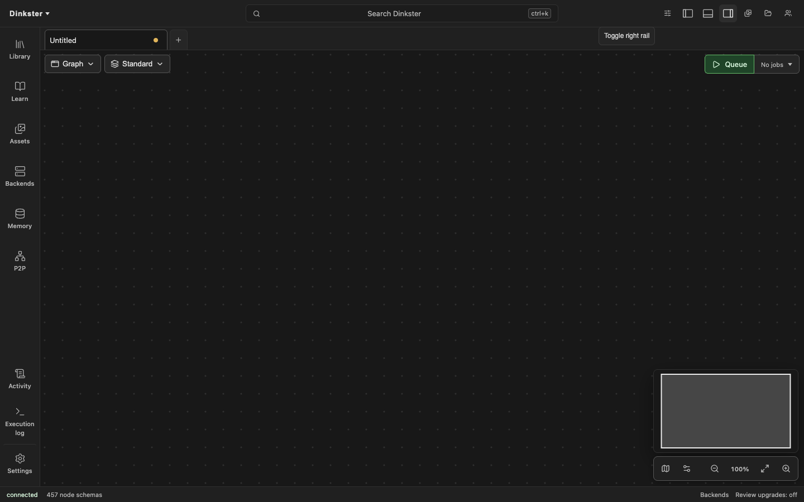

# Browser editor quickstart

The `dinkster` command starts the engine and browser frontend on one loopback
origin, prepares missing or stale pack catalogs, and opens the editor. These
source-checkout steps work on Windows x64, Linux x64, and macOS Apple Silicon.

## Install

Install [uv](https://docs.astral.sh/uv/getting-started/installation/) and
[Node.js](https://nodejs.org/), enable pnpm with `corepack enable`, then clone
the backend and frontend beside each other:

```sh
git clone https://github.com/Kosinkadink/Dinkster.git
git clone https://github.com/Kosinkadink/Dinkster-Frontend.git
cd Dinkster-Frontend
pnpm install --frozen-lockfile
pnpm --filter @dinkster/app build
cd ../Dinkster
uv sync --python 3.12 --all-packages --frozen
uv run dinkster setup
```

PowerShell, Command Prompt, and POSIX shells use the same commands. The setup
command creates the local library and managed-pack roots under `~/.dinkster`
(`%USERPROFILE%\.dinkster` on Windows). Set `DINKSTER_HOME` before setup and
launch to choose another writable location.

## Launch

```sh
uv run dinkster
```

The editor opens at `http://127.0.0.1:3639`. Its application, API, and event
connections all use that origin. The default pack suite includes the
foundation, media, vision, and training nodes. Collaboration routes are
available, while peer-to-peer discovery is disabled for the local launch.
Catalog preparation can make the first launch take longer than later launches.

Use Ctrl+C in the terminal to stop the engine. If the default port is busy,
run `uv run dinkster --port 4640`. Use `--no-browser` on a headless machine and
open the printed URL from a browser on that machine.



## Generate a first image

The launcher does not download model weights. Install the supported execution
runtime and SD 1.5 checkpoint described in [installation](install.md#browser-frontend-and-native-generation),
then use the standard SD 1.5 text-to-image workflow:

1. Load the checkpoint with `Load Checkpoint`.
2. Enter positive and negative text in the two `CLIP Text Encode` nodes.
3. Connect `Empty Latent Image`, the model, and both conditioning outputs to
   `KSampler`.
4. Decode the sampled latent with `VAE Decode` and connect it to `Save Image`.
5. Select **Run** and wait for the image preview and saved output.

This is the default SD 1.5 graph: checkpoint loader, two text encoders, empty
latent image, sampler, VAE decoder, and image saver. No ComfyUI checkout or
server is part of the native launch.
