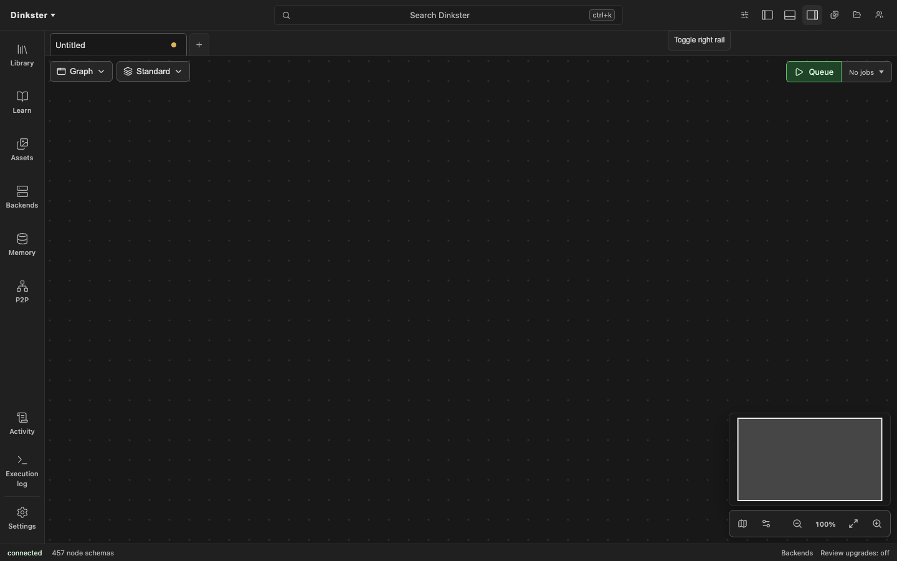

# Browser editor quickstart

The `dinkster` command starts the engine and browser frontend on one loopback
origin, prepares missing or stale pack catalogs, and opens the editor. These
source-checkout steps work on Windows x64, Linux x64, and macOS Apple Silicon.

## Install

Install [Node.js 22 or newer](https://nodejs.org/), including npm, and
[Git](https://git-scm.com/downloads). Clone Dinkster, then run one command:

```sh
git clone https://github.com/Kosinkadink/Dinkster.git
cd Dinkster
./run.sh
```

On Windows, replace `./run.sh` with:

```powershell
.\run.ps1
```

If PowerShell blocks local scripts, use
`powershell -NoProfile -ExecutionPolicy Bypass -File .\run.ps1`.
If uv is missing, the script installs it using the
[official installer](https://docs.astral.sh/uv/getting-started/installation/)
in `~/.local/bin` (`%USERPROFILE%\.local\bin` on Windows), without sudo,
administrator rights, or shell-profile changes. Linux/macOS need curl or wget
for this download. The installed uv is available immediately to the script.
The script uses uv-managed Python 3.12 with development headers included,
prepares the pinned inference and Torch
environments, builds the pinned frontend, creates local state, and opens the
editor. It does not need the Desktop app or a separate frontend checkout.
The first run downloads dependencies and can take several minutes. NVIDIA
machines need a driver compatible with the pinned CUDA 13.0 Torch runtime.
macOS uses the native Torch wheel with MPS; machines without NVIDIA use CPU.
An empty `CUDA_VISIBLE_DEVICES` (or `-1`) forces CPU. If NVIDIA detection fails
or the installed driver cannot use CUDA Torch, the launcher reports the reason
and uses CPU Torch instead of blocking the editor.

The scripts create the local library and managed-pack roots under `~/.dinkster`
(`%USERPROFILE%\.dinkster` on Windows). Set `DINKSTER_HOME` before launch to
choose another writable location. They preserve model mounts and output files.

## Launch

```sh
./run.sh
```

Use `.\run.ps1` on Windows. After `git pull`, run the same command: environments
are refreshed and the frontend rebuilds when its pin changes. The private
`.run/frontend` directory is script-managed; do not edit it.

The editor opens at `http://127.0.0.1:3639`. Its application, API, and event
connections all use that origin. The default pack suite includes the
foundation, media, and vision nodes. The default Dinkster install also includes
the independently installable `dinkster-collab` collaboration routes and
`dinkster-supervisor` process supervisor. The command above starts the engine
directly with collaboration enabled; peer-to-peer discovery is disabled for
the local launch.
The first launch prepares pack catalogs and normally takes 25 to 35 seconds before the editor
answers. The terminal reports each completed pack and the total preparation time. Later launches
skip catalog preparation unless pack code has changed.

Use Ctrl+C in the terminal to stop the engine. If the default port is busy,
run `./run.sh --port 4640` (`.\run.ps1 --port 4640` on Windows).
Use `--no-browser` on a headless machine and
open the printed URL from a browser on that machine.

To put the supervisor in front of the engine, run:

```sh
uv run dinkster-supervisor -- uv run --no-sync dinkster-serve
```

An embedded or headless core installation may omit both optional packages.
From a source checkout, remove them from the environment and disable automatic
sync while launching so the default meta-package does not restore them:

```sh
uv sync --no-install-package dinkster-collab --no-install-package dinkster-supervisor
uv run --no-sync dinkster-serve
```

Installers that select capabilities explicitly can use the `dinkster[collab]`
and `dinkster[supervisor]` extras. The default `dinkster` install selects both.



## Generate a first image

The launcher does not download model weights. Download the SD 1.5 checkpoint
`v1-5-pruned-emaonly-fp16.safetensors` into a dedicated models folder, then add
that folder to `~/.dinkster/library/mounts.toml`:

```toml
[mounts.models]
path = "/absolute/path/to/models"
mode = "read"
priority = 0
```

On Windows, use a TOML path such as `C:/Users/name/Models`. Keep the existing
`[settings]` and `[mounts.output]` sections that `dinkster setup` created. See
[installation](install.md#model-folders) for the full format.

The run scripts select the execution interpreter automatically, including
during pack-catalog preparation. No ComfyUI checkout or server is required.
CPU and Apple Silicon model sampling remains subject to the
[supported host boundaries](supported/cpu-and-apple-silicon-hosts.md).

Workflow templates and P2P are disabled by default. Build an SD 1.5 workflow
on the empty canvas:

1. Load the checkpoint with `Load Checkpoint`.
2. Enter positive and negative text in the two `CLIP Text Encode` nodes.
3. Connect `Empty Latent Image`, the model, and both conditioning outputs to
   `KSampler`.
4. Decode the sampled latent with `VAE Decode` and connect it to `Save Image`.
5. Select **Run** and wait for the image preview and saved output.

In `Load Checkpoint`, use **Browse** to select the mounted checkpoint. If no
models are available, check the `models` path in `mounts.toml` and restart
Dinkster so it can scan the folder.

This is the default SD 1.5 graph: checkpoint loader, two text encoders, empty
latent image, sampler, VAE decoder, and image saver. No ComfyUI checkout or
server is part of the native launch.
